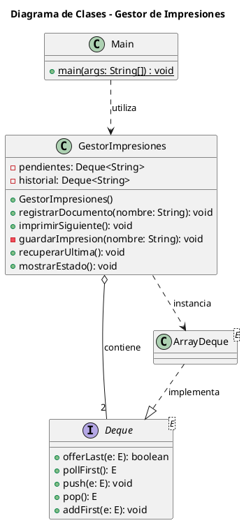

# Laboratorio


# 🖨️ Gestor de Impresiones - Laboratorio de Estructuras de Datos

<p align="center">
  <strong>Implementación de Pilas y Colas mediante Deque<E> y ArrayDeque en Java</strong>
</p>

---

## 📋 Descripción del Proyecto

El **Gestor de Impresiones** es un sistema desarrollado en **Java** que simula el funcionamiento de una cola de impresión en un entorno operativo. El proyecto aplica los conceptos de **Colas (Queue / FIFO)** y **Pilas (Stack / LIFO)** mediante la interfaz estandarizada `Deque<E>` y su implementación `ArrayDeque`.

El sistema permite registrar documentos pendientes de impresión, procesarlos en orden de llegada y almacenar un historial de los documentos impresos. Además, incluye una funcionalidad de recuperación que permite devolver el último documento impreso al frente de la cola de pendientes.

Este proyecto tiene como finalidad reforzar el aprendizaje de las estructuras de datos, el uso de interfaces de Java y la aplicación de principios de programación orientada a objetos.

### 🎯 Objetivo General

Implementar un sistema de gestión de impresiones en Java que permita aplicar las estructuras de datos **Cola (FIFO)** y **Pila (LIFO)** utilizando la interfaz `Deque<E>`, con el propósito de comprender sus operaciones y su aplicación en un escenario práctico.

---

## ⚙️ Funcionalidades del Sistema

El sistema administra dos flujos de trabajo principales:

### 📥 1. Gestión de Documentos Pendientes (Cola - FIFO)

Los documentos pendientes se gestionan mediante una cola que sigue el principio **FIFO (First In, First Out)**.

Esto significa que el primer documento registrado es el primero en ser procesado.

**Características:**

- Registrar nuevos documentos al final de la cola.
- Imprimir el documento que se encuentra al frente.
- Mantener el orden de llegada de los documentos.
- Consultar los documentos que permanecen pendientes.
- Evitar la extracción de documentos cuando la cola está vacía.

**Ejemplo de funcionamiento:**

```text
Registro de documentos:

Documento_A → Documento_B → Documento_C

Orden de impresión:

Documento_A → Documento_B → Documento_C
```

### 📚 2. Gestión del Historial (Pila - LIFO)

Los documentos que ya fueron impresos se almacenan en una pila que sigue el principio **LIFO (Last In, First Out)**.

Esto significa que el último documento impreso es el primero que puede recuperarse.

**Características:**

- Almacenar los documentos impresos en el historial.
- Recuperar el último documento registrado en el historial.
- Devolver el documento recuperado al frente de la cola.
- Validar si el historial está vacío antes de realizar una recuperación.

**Ejemplo de funcionamiento:**

```text
Historial de impresiones:

Documento_C  ← Último documento impreso
Documento_B
Documento_A

Recuperación:

Documento_C → Se devuelve al frente de la cola
```

---

## 🏗️ Estructura del Proyecto

El proyecto está organizado en diferentes carpetas que contienen el código fuente, la documentación, el diagrama de clases y las evidencias de ejecución.

```text
Laboratorio/
│
├── .qodo/
│
├── Diagrama de clases/
│   └── Diagrama de clases.png
│
├── Doc,PDF/
│   ├── TDA-Laboratorio.docx
│   └── TDA-Laboratorio.pdf
│
├── Evidencias/
│   └── Ejecucion.png
│
├── laboratorio/
│   ├── GestorImpresiones.java
│   └── Main.java
│
└── README.md
```

### 📁 Descripción de las Carpetas y Archivos

| Carpeta / Archivo | Descripción |
|---|---|
| `.qodo/` | Carpeta de configuración o archivos relacionados con la herramienta utilizada en el entorno de desarrollo. |
| `Diagrama de clases/` | Contiene la imagen del diagrama de clases del proyecto. |
| `Doc,PDF/` | Almacena la documentación del laboratorio en formatos Word y PDF. |
| `Evidencias/` | Contiene las capturas de pantalla de la ejecución del programa. |
| `laboratorio/` | Paquete que contiene las clases principales del sistema en Java. |
| `GestorImpresiones.java` | Clase encargada de administrar la cola de pendientes y el historial de impresiones. |
| `Main.java` | Clase principal que ejecuta las operaciones y pruebas del sistema. |
| `README.md` | Documento que describe el proyecto, su funcionamiento y su estructura. |

> **Nota:** El archivo `~$A-Laboratorio.docx` es un archivo temporal que Microsoft Word suele generar al abrir un documento. No es necesario incluirlo en el repositorio si no se requiere.

---

## 🧠 Conceptos de Estructuras de Datos Aplicados

El proyecto utiliza la interfaz `Deque<E>` de Java para implementar dos estructuras de datos con comportamientos diferentes.

### 🔹 Cola (FIFO)

La cola utiliza el principio **First In, First Out**, donde el primer elemento que ingresa es el primero en salir.

Para implementar la cola de documentos pendientes se utiliza:

```java
Deque<String> pendientes = new ArrayDeque<>();
```

#### Operaciones principales

| Operación | Método | Descripción |
|---|---|---|
| Insertar al final | `offerLast()` | Añade un documento al final de la cola. |
| Extraer del frente | `pollFirst()` | Retira el documento ubicado al frente de la cola. |
| Consultar vacío | `isEmpty()` | Comprueba si la cola no contiene elementos. |

**Ejemplo:**

```java
pendientes.offerLast("Documento_A");
pendientes.offerLast("Documento_B");

String documento = pendientes.pollFirst();
```

Resultado:

```text
Documento extraído: Documento_A
```

### 🔹 Pila (LIFO)

La pila utiliza el principio **Last In, First Out**, donde el último elemento que ingresa es el primero en salir.

Para implementar el historial se utiliza:

```java
Deque<String> historial = new ArrayDeque<>();
```

#### Operaciones principales

| Operación | Método | Descripción |
|---|---|---|
| Insertar en la cima | `push()` | Añade un documento a la cima de la pila. |
| Extraer de la cima | `pop()` | Retira el documento ubicado en la cima. |
| Consultar vacío | `isEmpty()` | Comprueba si la pila no contiene elementos. |

**Ejemplo:**

```java
historial.push("Documento_A");
historial.push("Documento_B");

String documento = historial.pop();
```

Resultado:

```text
Documento extraído: Documento_B
```

---

## 📌 Clases Principales del Proyecto

### 1. `GestorImpresiones.java`

Es la clase lógica encargada de administrar el estado y las operaciones del sistema de impresión.

#### Atributos

| Atributo | Tipo | Descripción |
|---|---|---|
| `pendientes` | `Deque<String>` | Cola FIFO que almacena los documentos pendientes de impresión. |
| `historial` | `Deque<String>` | Pila LIFO que almacena los documentos que ya fueron impresos. |

Ambas estructuras utilizan `ArrayDeque` como implementación.

#### Métodos principales

| Método | Tipo de acceso | Descripción |
|---|---|---|
| `GestorImpresiones()` | Público | Inicializa la cola de pendientes y la pila del historial. |
| `registrarDocumento(String nombre)` | Público | Añade un documento al final de la cola mediante `offerLast()`. |
| `imprimirSiguiente()` | Público | Retira el primer documento de la cola mediante `pollFirst()` y lo guarda en el historial. |
| `guardarImpresion(String nombre)` | Privado | Almacena un documento impreso en la cima del historial mediante `push()`. |
| `recuperarUltima()` | Público | Extrae el último documento del historial mediante `pop()` y lo coloca al frente de la cola mediante `addFirst()`. |
| `mostrarEstado()` | Público | Muestra el contenido actual de la cola de pendientes y del historial. |

---

### 2. `Main.java`

Es la clase principal encargada de ejecutar las pruebas y validar el funcionamiento del sistema.

En esta clase se realizan operaciones combinadas para comprobar la interacción entre la cola y la pila.

#### Operaciones que se pueden probar

- Registrar varios documentos.
- Mostrar los documentos pendientes.
- Imprimir el siguiente documento.
- Almacenar las impresiones en el historial.
- Recuperar el último documento impreso.
- Volver a mostrar el estado del sistema.
- Intentar imprimir cuando la cola está vacía.
- Intentar recuperar un documento cuando el historial está vacío.

---

## 🔄 Mapeo de Operaciones y Estructuras

La siguiente tabla relaciona las acciones del sistema con las estructuras de datos y los métodos utilizados.

| Acción del sistema | Estructura utilizada | Operación de `Deque` | Comportamiento |
|---|---|---|---|
| Registrar documento | Cola FIFO | `offerLast(nombre)` | El documento se añade al final de la cola. |
| Imprimir siguiente | Cola FIFO | `pollFirst()` | Se retira el documento más antiguo de la cola. |
| Guardar impresión | Pila LIFO | `push(nombre)` | El documento impreso se almacena en la cima del historial. |
| Recuperar última | Pila + Cola | `pop()` + `addFirst()` | Se extrae el último documento impreso y se coloca al frente de la cola. |
| Mostrar estado | Cola + Pila | Recorrido de estructuras | Se muestra el contenido de ambas estructuras. |
| Validar vacío | Cola + Pila | `isEmpty()` | Se comprueba si existen elementos antes de extraerlos. |

---

## 📐 Diagrama de Clases

El diseño del sistema se representa mediante un diagrama de clases que muestra la relación entre las clases principales y las estructuras utilizadas.

El diagrama se encuentra en la carpeta:

```text
Diagrama de clases/
└── Diagrama de clases.png
```

### 🧩 Representación del Diagrama mediante PlantUML



### 📊 Relaciones entre las clases

- `Main` utiliza la clase `GestorImpresiones` para ejecutar las operaciones del sistema.
- `GestorImpresiones` contiene dos estructuras de tipo `Deque<String>`.
- `ArrayDeque` proporciona una implementación de la interfaz `Deque`.
- La cola de pendientes utiliza operaciones FIFO.
- El historial utiliza operaciones LIFO.
- La interfaz `Deque` permite trabajar con operaciones de cola y pila sobre una misma estructura.

---

## 🚀 Requisitos e Instalación

### 🛠️ Prerrequisitos

Para ejecutar el proyecto se necesita:

- **JDK:** Java 8 o superior.
- **IDE o editor:** Visual Studio Code, IntelliJ IDEA, Eclipse, NetBeans o cualquier entorno compatible con Java.
- Conocimientos básicos de programación en Java y estructuras de datos.

### 📥 1. Clonar el repositorio

Si el proyecto se encuentra en GitHub, clona el repositorio mediante:

```bash
git clone URL_DEL_REPOSITORIO
```

Ingresa a la carpeta del proyecto:

```bash
cd NOMBRE_DEL_REPOSITORIO
```

> Reemplaza `URL_DEL_REPOSITORIO` y `NOMBRE_DEL_REPOSITORIO` con los datos reales de tu repositorio.

### 🔨 2. Compilar el proyecto

Desde la carpeta raíz del proyecto `Laboratorio`, ejecuta:

```bash
javac laboratorio/GestorImpresiones.java laboratorio/Main.java
```

### ▶️ 3. Ejecutar el programa

```bash
java laboratorio.Main
```

### 💻 4. Ejecución desde Visual Studio Code

1. Abre la carpeta `Laboratorio` en Visual Studio Code.
2. Ingresa a la carpeta `laboratorio`.
3. Abre el archivo `Main.java`.
4. Ejecuta el método `main()` utilizando el botón **Run Java**.
5. Revisa los resultados en la terminal integrada.

---

## 🧪 Validaciones Implementadas

El sistema incorpora validaciones para evitar errores durante la ejecución de las operaciones de las estructuras de datos.

### ✅ 1. Manejo de estructuras vacías (Underflow)

Antes de extraer elementos de las estructuras, se verifica si contienen información.

#### `imprimirSiguiente()`

Comprueba si existen documentos pendientes antes de intentar imprimir.

Si la cola está vacía, se muestra un mensaje informativo y no se realiza la extracción.

#### `recuperarUltima()`

Comprueba si el historial contiene documentos antes de realizar la recuperación.

Si el historial está vacío, se muestra un mensaje informativo y no se realiza la extracción.

Estas validaciones ayudan a evitar errores como `NoSuchElementException` al utilizar operaciones de extracción que requieren un elemento.

### ✅ 2. Integridad del flujo de documentos

El sistema permite transferir documentos entre el historial y la cola de pendientes.

Cuando se recupera un documento:

1. Se extrae el último documento del historial mediante `pop()`.
2. Se inserta al frente de la cola mediante `addFirst()`.
3. El documento queda disponible para ser impreso nuevamente.

La transferencia se realiza mediante dos operaciones consecutivas. En una ejecución normal, el documento recuperado se conserva y se coloca en la cola de pendientes.

> **Nota:** La transferencia entre estructuras no constituye una transacción atómica en el sentido de una base de datos. El código puede validarse para mantener el estado esperado durante la ejecución normal del programa.

---

## 🔁 Ejemplo de Funcionamiento

A continuación, se representa un ejemplo del flujo de operaciones del sistema.

### 1. Registrar documentos

Se registran tres documentos en la cola de pendientes:

```text
Registrar: Documento_A
Registrar: Documento_B
Registrar: Documento_C
```

**Cola de pendientes:**

```text
[Documento_A, Documento_B, Documento_C]
```

**Historial:**

```text
[]
```

### 2. Imprimir documentos

Se imprimen dos documentos:

```text
Imprimir: Documento_A
Imprimir: Documento_B
```

**Cola de pendientes:**

```text
[Documento_C]
```

**Historial de impresiones (cima → base):**

```text
[Documento_B, Documento_A]
```

### 3. Recuperar la última impresión

Se recupera el último documento impreso:

```text
Recuperar: Documento_B
```

**Cola de pendientes:**

```text
[Documento_B, Documento_C]
```

**Historial de impresiones (cima → base):**

```text
[Documento_A]
```

El documento recuperado se coloca al frente de la cola para tener prioridad en la siguiente impresión.

---

## 📸 Evidencias de Ejecución

La carpeta `Evidencias/` contiene las capturas de pantalla que muestran el funcionamiento del programa.

### 🖥️ Captura de ejecución

Archivo de evidencia:

```text
Evidencias/
└── Ejecucion.png
```

La evidencia permite documentar los resultados obtenidos al ejecutar las operaciones del gestor de impresiones.

---

## 📄 Documentación del Laboratorio

La carpeta `Doc,PDF/` contiene los documentos relacionados con el desarrollo del laboratorio.

| Archivo | Descripción |
|---|---|
| `TDA-Laboratorio.docx` | Documento de la práctica en formato Word. |
| `TDA-Laboratorio.pdf` | Documento de la práctica en formato PDF. |

Estos archivos complementan la información del proyecto y permiten consultar el desarrollo de la actividad académica.

---

## 🎓 Conocimientos Adquiridos

Mediante el desarrollo de este proyecto se aplican los siguientes conceptos:

- Implementación de colas mediante la interfaz `Deque<E>`.
- Implementación de pilas mediante la interfaz `Deque<E>`.
- Uso de `ArrayDeque` en Java.
- Aplicación de los principios FIFO y LIFO.
- Uso de métodos de inserción y extracción.
- Validación de estructuras de datos vacías.
- Diseño de clases y encapsulamiento.
- Organización de proyectos Java mediante paquetes.
- Representación de relaciones entre clases con PlantUML.
- Aplicación de estructuras de datos en un escenario práctico.

---

## 📌 Conclusión

El proyecto **Gestor de Impresiones** permite comprender de manera práctica el funcionamiento de las estructuras de datos **Cola y Pila**, aplicándolas a un escenario de gestión de documentos.

Mediante el uso de la interfaz `Deque<E>` y la implementación `ArrayDeque`, se desarrollan operaciones de registro, impresión, almacenamiento de historial y recuperación de documentos.

La práctica contribuye al fortalecimiento de los conocimientos de programación en Java, el manejo de estructuras de datos y el diseño de soluciones orientadas a objetos. Además, permite observar cómo una misma interfaz puede utilizarse para representar diferentes comportamientos según las operaciones aplicadas.

---

## 👨‍💻 Autor

**Joel Tisalema**

**Proyecto:** Laboratorio de Estructuras de Datos

**Tecnología utilizada:** Java

**Estructuras implementadas:** Cola (FIFO) y Pila (LIFO)

---

<p align="center">
  <strong>Laboratorio de Estructuras de Datos - Java</strong>
</p>
