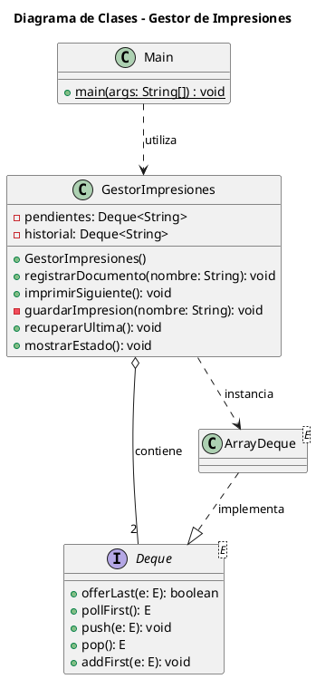

# Laboratorio


# 🖨️ Gestor de Impresiones - Laboratorio de Estructuras de Datos

## 📋 Descripción del Proyecto

El **Gestor de Impresiones** es un sistema desarrollado en **Java** que simula el funcionamiento de una cola de impresión en un entorno operativo. El proyecto aplica los conceptos de **Colas (Queue / FIFO)** y **Pilas (Stack / LIFO)** mediante la interfaz `Deque<E>` y su implementación `ArrayDeque`.

El sistema permite registrar documentos pendientes de impresión, procesarlos en orden de llegada y almacenar un historial de documentos impresos. Además, incorpora una función de recuperación que permite volver a colocar el último documento impreso al frente de la cola.

### 🎯 Objetivo

Implementar y comprender el funcionamiento de las estructuras de datos **Cola y Pila**, utilizando las operaciones proporcionadas por la interfaz `Deque<E>` de Java para gestionar documentos pendientes e impresos.

---

## ⚙️ Funcionalidades del Sistema

El sistema administra dos estructuras principales:

### 1. 📥 Gestión de Documentos Pendientes (Cola - FIFO)

Los documentos se almacenan en una cola de tipo **FIFO (First In, First Out)**.

- Los documentos se registran al final de la cola.
- La impresión comienza por el documento que lleva más tiempo esperando.
- Los documentos se procesan respetando el orden de llegada.

**Ejemplo:**

```text
Registro:
Documento A → Documento B → Documento C

Orden de impresión:
Documento A → Documento B → Documento C
```

### 2. 📚 Gestión del Historial (Pila - LIFO)

Los documentos impresos se almacenan en una pila de tipo **LIFO (Last In, First Out)**.

- Cada documento impreso se guarda en la cima de la pila.
- El último documento impreso es el primero que puede recuperarse.
- La recuperación permite devolver un documento al frente de la cola de pendientes.

**Ejemplo:**

```text
Historial de impresiones:

Documento C  ← Último documento impreso
Documento B
Documento A

Recuperación:
Documento C → Se devuelve al frente de la cola
```

---

## 🏗️ Estructura del Proyecto

El proyecto se encuentra organizado dentro del paquete `laboratorio` y está compuesto por dos clases principales.

```text
GestorImpresiones/
│
├── laboratorio/
│   ├── GestorImpresiones.java
│   └── Main.java
│
└── README.md
```

### 📌 1. GestorImpresiones.java

Es la clase encargada de administrar las operaciones de la cola de documentos pendientes y la pila del historial de impresiones.

#### Atributos

| Atributo | Tipo | Descripción |
|---|---|---|
| `pendientes` | `Deque<String>` | Cola FIFO que almacena los documentos pendientes de impresión. |
| `historial` | `Deque<String>` | Pila LIFO que almacena los documentos que ya fueron impresos. |

Ambas estructuras utilizan `ArrayDeque` como implementación.

#### Métodos principales

| Método | Descripción |
|---|---|
| `GestorImpresiones()` | Inicializa las estructuras de pendientes e historial. |
| `registrarDocumento(String nombre)` | Añade un documento al final de la cola mediante `offerLast()`. |
| `imprimirSiguiente()` | Retira el primer documento de la cola mediante `pollFirst()` y lo registra en el historial. |
| `guardarImpresion(String nombre)` | Método privado que almacena un documento impreso en la cima del historial mediante `push()`. |
| `recuperarUltima()` | Recupera el último documento del historial mediante `pop()` y lo coloca al frente de la cola mediante `addFirst()`. |
| `mostrarEstado()` | Muestra el contenido actual de la cola de pendientes y del historial. |

---

### 📌 2. Main.java

Es la clase principal encargada de ejecutar y comprobar el funcionamiento del sistema.

En esta clase se realizan diferentes operaciones para validar la interacción entre las estructuras de datos, incluyendo:

- Registro de documentos.
- Impresión de documentos pendientes.
- Almacenamiento del historial.
- Recuperación del último documento impreso.
- Visualización del estado de las estructuras.
- Comprobación de operaciones cuando las estructuras están vacías.

---

## 🧠 Conceptos de Estructuras de Datos Aplicados

### 🔹 Cola (FIFO)

La cola utiliza el principio **First In, First Out**, donde el primer elemento en ingresar es el primero en salir.

Se implementa mediante `Deque<String>` y `ArrayDeque<String>`.

```java
pendientes.offerLast(nombre);
pendientes.pollFirst();
```

| Operación | Método | Función |
|---|---|---|
| Insertar | `offerLast()` | Añade un documento al final de la cola. |
| Extraer | `pollFirst()` | Retira el documento que se encuentra al frente. |

### 🔹 Pila (LIFO)

La pila utiliza el principio **Last In, First Out**, donde el último elemento en ingresar es el primero en salir.

Se implementa mediante la misma interfaz `Deque<String>`, utilizando operaciones de pila.

```java
historial.push(nombre);
historial.pop();
```

| Operación | Método | Función |
|---|---|---|
| Insertar | `push()` | Añade un documento a la cima de la pila. |
| Extraer | `pop()` | Retira el documento ubicado en la cima. |

---

## 🔄 Mapeo de Operaciones

La siguiente tabla relaciona las acciones del sistema con las estructuras de datos y las operaciones utilizadas.

| Acción del sistema | Estructura | Operación de `Deque` | Comportamiento |
|---|---|---|---|
| Registrar documento | Cola FIFO | `offerLast()` | Añade el documento al final. |
| Imprimir siguiente | Cola FIFO | `pollFirst()` | Retira el documento más antiguo. |
| Guardar impresión | Pila LIFO | `push()` | Almacena el documento en la cima. |
| Recuperar última | Pila + Cola | `pop()` + `addFirst()` | Retira el último documento impreso y lo coloca al frente de pendientes. |
| Mostrar estado | Cola + Pila | Recorrido de estructuras | Muestra el contenido actual del sistema. |

---

## 📐 Diagrama de Clases

El diseño del proyecto se representa mediante el siguiente diagrama de clases elaborado con **PlantUML**.



### 📊 Relación entre las clases

- `Main` utiliza la clase `GestorImpresiones` para ejecutar las operaciones del sistema.
- `GestorImpresiones` contiene dos estructuras de tipo `Deque<String>`.
- `ArrayDeque` proporciona la implementación concreta de la interfaz `Deque`.
- La cola de pendientes utiliza operaciones FIFO.
- El historial utiliza operaciones LIFO.

---

## 🚀 Requisitos e Instalación

### 🛠️ Prerrequisitos

Para ejecutar el proyecto se necesita:

- **JDK:** Java 8 o superior.
- **IDE o editor:** Visual Studio Code, IntelliJ IDEA, Eclipse, NetBeans o cualquier entorno compatible con Java.
- Conocimientos básicos de programación orientada a objetos y estructuras de datos.

### 📥 1. Clonar el repositorio

Si el proyecto se encuentra en GitHub, clona el repositorio utilizando:

```bash
git clone URL_DEL_REPOSITORIO
```

Ingresa a la carpeta del proyecto:

```bash
cd NOMBRE_DEL_REPOSITORIO
```

> Reemplaza `URL_DEL_REPOSITORIO` y `NOMBRE_DEL_REPOSITORIO` con los datos de tu proyecto.

### 🔨 2. Compilar el proyecto

Desde la carpeta raíz del proyecto, ejecuta:

```bash
javac laboratorio/GestorImpresiones.java laboratorio/Main.java
```

### ▶️ 3. Ejecutar el programa

```bash
java laboratorio.Main
```

---

## 🧪 Validaciones Implementadas

El sistema contempla validaciones para evitar errores durante la ejecución de las operaciones.

### ✅ Manejo de estructuras vacías

Antes de extraer elementos de las estructuras, se comprueba si contienen información.

- `imprimirSiguiente()`: Verifica si existen documentos pendientes antes de intentar imprimir.
- `recuperarUltima()`: Verifica si el historial contiene documentos antes de realizar una recuperación.

Estas validaciones evitan intentos de extracción de elementos inexistentes.

### ✅ Integridad del flujo de documentos

El sistema permite transferir documentos entre el historial y la cola de pendientes.

Cuando se recupera un documento:

1. Se extrae el último documento del historial mediante `pop()`.
2. Se inserta al frente de la cola mediante `addFirst()`.
3. El documento queda disponible para ser impreso nuevamente.

Esto permite mantener el flujo de recuperación sin perder el documento durante la transferencia.

> **Nota:** La recuperación se realiza mediante dos operaciones consecutivas. Si se requiere una transferencia estrictamente atómica ante posibles errores de ejecución, se debería incorporar un mecanismo adicional de control.

---

## 🔁 Ejemplo de Funcionamiento

El siguiente ejemplo representa un flujo de operaciones del sistema.

### 1. Registrar documentos

```text
Registrar: Documento_A
Registrar: Documento_B
Registrar: Documento_C
```

**Cola de pendientes:**

```text
[Documento_A, Documento_B, Documento_C]
```

### 2. Imprimir documentos

```text
Imprimir: Documento_A
Imprimir: Documento_B
```

**Cola de pendientes:**

```text
[Documento_C]
```

**Historial de impresiones:**

```text
[Documento_B, Documento_A]
```

### 3. Recuperar la última impresión

```text
Recuperar: Documento_B
```

**Cola de pendientes:**

```text
[Documento_B, Documento_C]
```

**Historial de impresiones:**

```text
[Documento_A]
```

El documento recuperado se coloca al frente de la cola para tener prioridad en la siguiente impresión.

---

## 🎓 Conocimientos Adquiridos

Mediante el desarrollo de este proyecto se aplican los siguientes conceptos:

- Implementación de colas mediante la interfaz `Deque<E>`.
- Implementación de pilas mediante la interfaz `Deque<E>`.
- Uso de `ArrayDeque` en Java.
- Aplicación de los principios FIFO y LIFO.
- Manejo de métodos de inserción y extracción.
- Validación de estructuras de datos vacías.
- Diseño de clases y encapsulamiento.
- Organización de proyectos Java mediante paquetes.
- Representación de relaciones entre clases con PlantUML.

---

## 📌 Conclusión

El proyecto **Gestor de Impresiones** permite comprender de manera práctica el funcionamiento de las estructuras de datos **Cola y Pila**, aplicándolas a un escenario de gestión de documentos.

Mediante el uso de `Deque<E>` y `ArrayDeque`, se implementan operaciones de registro, impresión, almacenamiento de historial y recuperación de documentos. Esta práctica contribuye al desarrollo de habilidades relacionadas con la programación en Java, el manejo de estructuras de datos y el diseño de soluciones orientadas a objetos.

---

## 👨‍💻 Autor

**Joel Tisalema**

Proyecto académico - Laboratorio de Estructuras de Datos.

**Tecnología utilizada:** Java
